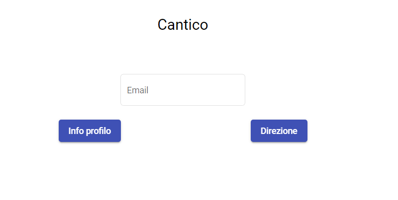

# CanticoFe

This project was generated with [Angular CLI](https://github.com/angular/angular-cli) version 10.0.1.

## Development server

Run `ng serve` for a dev server. Navigate to `http://localhost:4200/`. The app will automatically reload if you change any of the source files.

## Code scaffolding

Run `ng generate component component-name` to generate a new component. You can also use `ng generate directive|pipe|service|class|guard|interface|enum|module`.

## Build

Run `ng build` to build the project. The build artifacts will be stored in the `dist/` directory. Use the `--prod` flag for a production build.

## Running unit tests

Run `ng test` to execute the unit tests via [Karma](https://karma-runner.github.io).

## Running end-to-end tests

Run `ng e2e` to execute the end-to-end tests via [Protractor](http://www.protractortest.org/).

## Further help

To get more help on the Angular CLI use `ng help` or go check out the [Angular CLI README](https://github.com/angular/angular-cli/blob/master/README.md).

## docker
Docker image can be customized using the following environment variables

* `BE_HOST` Backend endpoint (IP:PORT)
* `FE_PORT` Port exposed by the application

A `docker-compose.yml` is also provided in order to build and deploy the container with
```
docker-compose up --force-recreate --build
```

The `.env` file contains the environment variables used to customize the application during the build with `docker-compose`. An example `.env` file is provided, with deploy configuration for Innovaway server.

## Note
Ai fini del test sono state inserite alcune anagrafiche. Le mail attive per poter compilare i profili legati alle suddette anagrafiche sono le seguenti:

* luca-cantico@mailinator.com
* claudio-cantico@mailinator.com
* ale-cantico@mailinator.com
* vale-cantico@mailinator.com
* anto-cantico@mailinator.com
* nargi-cantico@mailinator.com
* parisi-cantico@mailinator.com
* stella-cantico@mailinator.com
* francesca-cantico@mailinator.com

Per accedere alle caselle di posta, collegarsi a [Mailinator](https://www.mailinator.com/) e inserire la casella di posta desiderata nel campo `Enter Public Mailinator Inbox` e cliccare su `GO`.

## Manuale d'uso
All'avvio l'applicazione si presenta così


Inserendo una mail e cliccando su `Info profilo` è possibile compilare il profilo per l'utente associato all'indirizzo email. Una volta compilati i dati, cliccare su `Salva` in fondo alla pagina e poi su `Indietro`.

Cliccando su `Direzione` senza inserire un indirizzo email è possibile accedere alla sezione dedicata ai direttori dei teatri, in cui è possibile effettuare una ricerca degli utenti filtrando per dati di profilazione. Una volta trovati gli utenti corrispondenti ai criteri di ricerca, è possibile mandare un messaggio utilizzando per ognuno di essi il canale di notifica preferito (email, sms, push).
